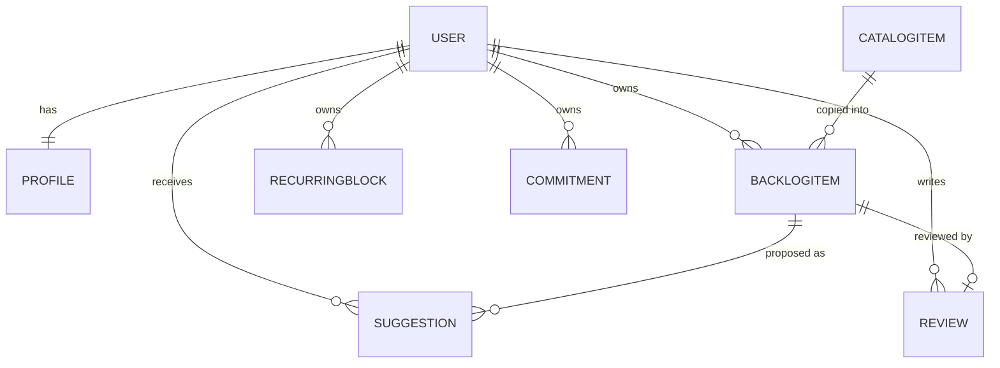
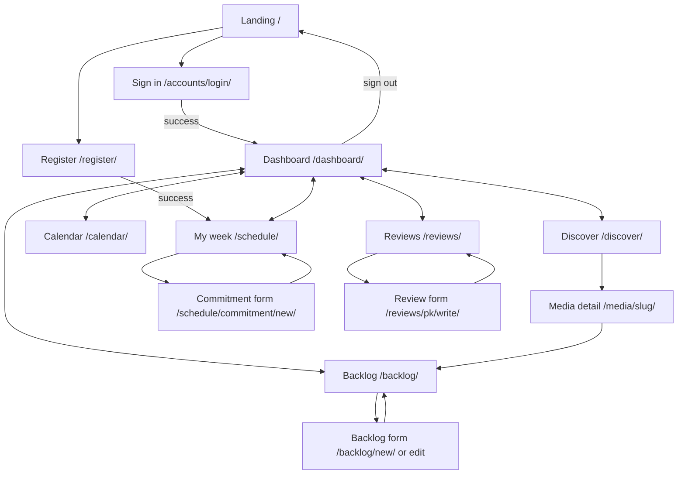
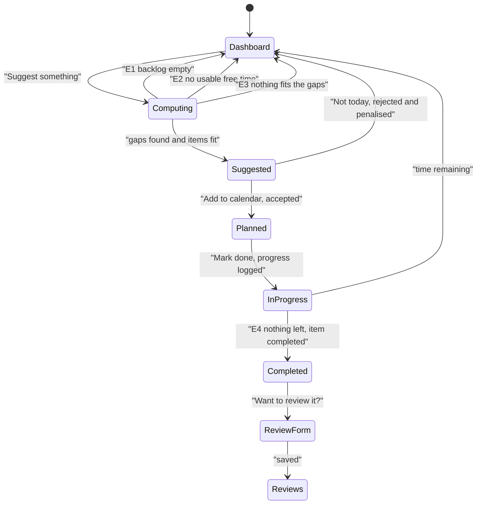
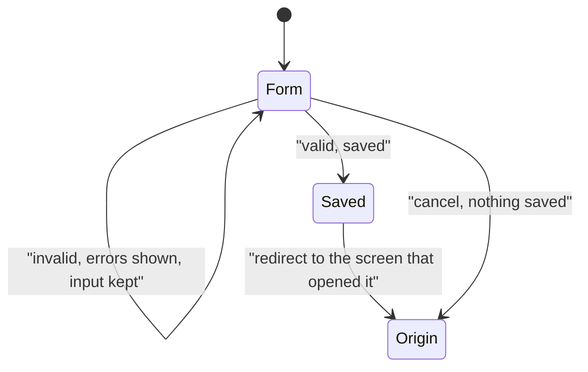

# MediaFlow: specification and design

Team 2, CSE 3311. Iteration 1.

This describes what we actually built. Where the inception deck and the code
disagree, we wrote down what the code does. Section 6 lists what we skipped.

MediaFlow keeps a student's films, TV, books and games in one backlog, works
out when they are free, and suggests something that fits the time they have.
It is a server-rendered Django app. Views live in `planner/views.py`, and all
the scheduling logic is in `planner/services.py` so we can test it without
going through HTTP.

Actors: a visitor (not signed in), a student (signed in with a
`@mavs.uta.edu` address, does everything below), an admin (maintains the
catalog), and the server clock, which matters because free time is measured
against the current time.

---

## 1. Inputs

Every signed-in request also carries a session cookie, a CSRF token on POSTs,
and the current time. The suggestion and priority forms carry a hidden `next`
field saying which screen to return to.

| Screen and route | Field | Type | Req | Rules |
| --- | --- | --- | --- | --- |
| Register `POST /register/` | `username` | text | yes | Unique |
| | `email` | email | yes | Must end in `@mavs.uta.edu`, not already used |
| | `password1`, `password2` | password | yes | Must match, pass Django's validators |
| Sign in `POST /accounts/login/` | `username`, `password` | text | yes | Must match an account |
| Waking hours `POST /schedule/` | `day_start` | time | yes | |
| | `day_end` | time | yes | After `day_start` |
| Recurring block `POST /schedule/` | `label` | text ≤120 | yes | |
| | `kind` | class/work/study/other | yes | Listed choice |
| | `weekday` | 0–6, Mon=0 | yes | Listed choice |
| | `start_time`, `end_time` | time | yes | End after start |
| Commitment `POST /schedule/commitment/new/` | `title` | text ≤200 | yes | |
| | `starts_at`, `ends_at` | datetime-local | yes | End after start, parsed `%Y-%m-%dT%H:%M` |
| Search `GET /discover/` | `q` | text | no | Matched on title, creator, description |
| | `media_type` | movie/tv/book/game | no | Listed choice |
| | `genre` | choice | no | Built from genres in the catalog |
| | `max_minutes` | int | no | At least 1 |
| | `sort` | choice | no | title, -rating, -release_date, typical_minutes |
| Backlog item `POST /backlog/new/` and `/<pk>/edit/` | `title` | text ≤200 | yes | |
| | `media_type` | one of four | yes | Listed choice |
| | `priority` | int | yes | 1–5 |
| | `estimated_minutes` | int | yes | 0 or more |
| | `minutes_completed` | int | yes | Not more than `estimated_minutes` |
| | `status` | backlog/in_progress/completed/paused | yes | Listed choice |
| | `notes` | text | no | |
| Review `POST /reviews/<pk>/write/` | `rating` | int | yes | 1–5 |
| | `body` | text | no | |
| Priority `POST /backlog/<pk>/priority/` | `priority` | int | yes | Clamped to 1–5, non-numeric ignored |
| Suggest `POST /suggestions/refresh/` | `date` | `YYYY-MM-DD` | no | Unparseable falls back to today |
| Respond `POST /suggestions/<pk>/<action>/` | `action` | URL segment | yes | accept, reject or done, else 404 |
| Calendar `GET /calendar/` | `date`, `year`, `month` | | no | Bad values fall back to today |
| Backlog list `GET /backlog/` | `status` | choice | no | Unrecognised values ignored |
| Seed command | `--demo` | flag | no | Also builds the demo account |

## 2. Outputs

| Output | When |
| --- | --- |
| HTML page | Every GET. Nine screens, see section 5. |
| Redirect | After every successful write, so a refresh never repeats it |
| Flash message | Writes, and suggestion runs that come back empty |
| Field errors | Any invalid form, redisplayed with what was typed |
| Free intervals | Start, end and length of each usable gap |
| Suggestions | Up to 3 rows, each with a written reason |
| Database rows | All writes, see section 3 |
| 404 | Unknown slug or pk, another user's row, unknown action |
| 302 to sign-in | Any `@login_required` view while signed out, with `?next=` |
| 405 | GET on a POST-only action |

Suggestion reasons are generated from the item and the gap, so the output
explains itself: "You have 3h free and its 2h 35m runtime fits in one sitting"
for a film, "2h free is just enough to finish it" for a last sitting, or "2h
free, so a chapter of this is a comfortable fit" for anything chunked.

---

## 3. Data structures

| Model | Fields | Notes |
| --- | --- | --- |
| `Profile` | `user` 1-1, `day_start`, `day_end` | Waking hours. Bounds the window we search for free time. Defaults 08:00 and 23:00. |
| `CatalogItem` | `title`, `slug` unique, `media_type`, `genre`, `creator`, `description`, `release_date`, `rating` 0–10, `typical_minutes` | The shared catalog. Slug is title plus type, so Dune the film and Dune the novel can coexist. `typical_minutes` is what the scheduler runs on. |
| `BacklogItem` | `user`, `catalog_item` nullable, `title`, `media_type`, `priority` 1–5, `estimated_minutes`, `minutes_completed`, `status`, `notes`, `added_at`, `completed_at` | One entry on a student's backlog. Ordered `-priority, added_at`. Unique on `(user, catalog_item)` so the same title can't be added twice; conditional on the FK not being null, or hand-typed items would collide. |
| `RecurringBlock` | `user`, `label`, `kind`, `weekday` Mon=0, `start_time`, `end_time` | Something that happens weekly. |
| `Commitment` | `user`, `title`, `starts_at`, `ends_at` | A one-off dated obligation. |
| `Suggestion` | `user`, `backlog_item`, `date`, `start_time`, `end_time`, `minutes`, `reason`, `status`, `created_at`, `responded_at` | One proposal: this item, this gap, this day. |
| `Review` | `user`, `backlog_item` 1-1, `rating` 1–5, `body` | |

Built at runtime, in `services.py` unless noted:

| Structure | Shape and purpose |
| --- | --- |
| `SESSION_RULES` (`models.py`) | `{media_type: {chunkable, chunk_minutes, max_minutes, unit}}`. Makes a film behave differently from a book. |
| `Interval` | Frozen dataclass `(start, end)` with `minutes`. One free gap. |
| `BusyBlock` | Frozen dataclass `(start, end, label, source)`. Flattens recurring blocks, commitments and accepted sessions into one shape. |
| `day_plan()` | `{date, busy[], free[], planned[], pending[]}`. Everything one day's screen needs. |
| `month_grid()` | Weeks of 7 cells, `{date, in_month, is_today, planned[]}`, built off one query. |
| Rejection counts | `{backlog_item_id: count}` over the last 14 days. |

**Why this shape.** Duration is a real field on both catalog and backlog items,
because "what fits tonight" is unanswerable without a number of minutes.
`SESSION_RULES` is a lookup table rather than if-statements, so a fifth media
type is a new row. We store when the user is busy and derive free time, since
students know their class times but not their gaps, and derived time is never
stale. `BusyBlock` means the sweep handles three row types with one branch.
Rejections are rows, not a flag, so the penalty can fade after 14 days instead
of hiding a title forever. `BacklogItem` copies the title off the catalog row
and the FK is `SET_NULL`, so a backlog still reads if a catalog entry goes.

**Free time.** `free_intervals()` puts a cursor at `day_start`, moves it to now
if the day is today, then walks the busy blocks in order. A block ending before
the cursor is skipped, a block starting after it leaves a gap, and either way
the cursor jumps to the block's end, so overlaps sort themselves out. Whatever
is left at the end is the last gap. Anything under 20 minutes is dropped.

**Sitting length.** `session_minutes_for()` returns the full runtime for a film
if it fits the gap and `None` if it doesn't, so a film that doesn't fit isn't a
candidate. Everything else is capped at `max_minutes` and rounded down to whole
chunks, or returns the remainder when that would finish the item.

**Scoring.** `priority x 20`, `+25` if already started, `+ (minutes/gap) x 30`
for using the gap well, `+15` for a film that fits, `+20` if the sitting would
finish it, `-35` per rejection in the last 14 days. `suggest_for_day()` takes
the biggest gaps first, never repeats an item in a day, and stops at three.

---

## 4. Use cases

All of these need the user signed in except UC-1 and UC-2, so "signed out
means a 302 to the sign-in page with `?next=`" applies throughout.

| Use case | Main flow | Exceptions |
| --- | --- | --- |
| **UC-1 Register** | Username, UTA email, password twice. Account and profile created, signed in, lands on My week. | E1 email not `@mavs.uta.edu`. E2 email already used. E3 passwords differ or fail validators. E4 username taken. All redisplay the form. |
| **UC-2 Sign in / out** | Credentials, then the dashboard. Sign out is a POST from the nav. | E1 wrong credentials, form redisplays. E2 arriving from a protected page, forwarded there after signing in. |
| **UC-3 Weekly schedule** | Add a recurring block on My week. Saved, listed under its weekday, seven-day free time updates. | E1 end not after start. E2 missing field. E3 overlapping blocks are allowed and merge when free time is computed. |
| **UC-4 Waking hours** | Set them on My week. Free time recalculates in the new window. | E1 bedtime not after wake-up. |
| **UC-5 Commitment** | Title and start/end. Back to My week, that date's free time drops. | E1 end not after start. E2 cancel saves nothing. E3 past midnight gets clipped to each day. |
| **UC-6 Search** | Any mix of text, type, genre, max minutes, sort. Results with a count. | E1 no matches. E2 no filters returns the catalog, capped at 60. E3 `max_minutes` below 1. |
| **UC-7 Media details** | Description, creator, date, rating, duration, and whether it fits today against the longest current gap. | E1 unknown slug, 404. E2 no free time, shows "No free time" not yes/no. E3 already on backlog, shows Edit and Remove. |
| **UC-8 Add to backlog** | Add from Discover or the detail page. Item created with the catalog's duration. | E1 already there, nothing duplicated (unique constraint). E2 not in the catalog, use Add manually. |
| **UC-9 Maintain backlog** | Change priority inline, edit, filter by status, remove. | E1 completed minutes above the estimate. E2 priority outside 1–5 clamped. E3 non-numeric priority ignored. E4 another user's item, 404. E5 setting status to completed backfills `completed_at`. |
| **UC-10 Get a suggestion** | Dashboard, "Suggest something". Pending ones cleared, gaps computed, best scorer for each of the biggest gaps. Max three, no repeats. | E1 backlog empty. E2 no usable free time. E3 nothing fits the gaps. E4 all gaps under 20 min, same as E2. E5 only films and none fit, same as E3. E6 GET instead of POST, 405. |
| **UC-11 Accept** | Suggestion goes to accepted, a backlog item moves to in progress, the time stops counting as free. | E1 another user's suggestion, 404. E2 accepting twice does nothing. |
| **UC-12 Reject** | Status rejected, item loses 35 points for 14 days. | E1 rejecting everything empties the list; a refresh can suggest the same items, ranked lower. |
| **UC-13 Mark done** | Minutes added to the item's progress. | E1 that finishes it, so status completed and the user is asked to review. E2 progress capped at the estimate. |
| **UC-14 Calendar** | Month grid from Sunday, planned sessions in the cells. Click a day for its busy blocks, sessions and gaps. | E1 unparseable date falls back to today. E2 bad year/month falls back. E3 empty day shows a notice. E4 more than two sessions shows "+N more". E5 paging months keeps the selected day. |
| **UC-15 Review** | Pick something finished, rate 1–5, optional text. | E1 rating outside 1–5. E2 reviewing something not marked complete marks it complete. E3 opening an existing review edits it, since it's one-to-one. |

Two decisions that look odd without the reason. UC-1 ends on My week, not the
dashboard, because a new account has no commitments and the dashboard would
show a whole free day and no suggestions. UC-10's E1 to E3 are three separate
messages because the fix is different each time, and "no suggestions" alone
wouldn't say which one you're looking at.

---

## 5. Screen transitions

Every signed-in screen carries the same nav, so any of the six main screens
reaches any other in one click. Only the four forms are dead ends, and each
returns to whatever opened it.

The suggestion loop, which is UC-10 to UC-13:

Every form behaves the same way, so this one graph covers the register, block,
commitment, backlog and review forms and their exceptions:

---

## 6. Consistency, traceability, and what we skipped

Four rules hold everywhere, which is what keeps the use cases and the graphs
in agreement:

1. Successful writes redirect, never render, so refreshing can't repeat one.
2. Failed validation returns to the same form, never forward. That is why the
   exception edges are all self-loops.
3. The `next` field decides where an action returns to. Accept and reject
   appear on both the dashboard and the calendar and each passes its own
   `next`, so the same transitions on two screens don't conflict.
4. Every row is fetched filtered by `user`, so touching another user's data is
   a 404 everywhere. No graph has an edge between two users' data.

| Use case | Route | View | Tests |
| --- | --- | --- | --- |
| UC-1 | `/register/` | `register` | `RegisterTests` |
| UC-2 | `/accounts/login/` | Django auth | `test_dashboard_requires_login` |
| UC-3, UC-4 | `/schedule/` | `weekly_schedule` | `FreeTimeTests`, `test_waking_hours_limit_search` |
| UC-5 | `/schedule/commitment/new/` | `add_commitment` | `test_dated_commitment` |
| UC-6 | `/discover/` | `discover` | `test_discover_filters` |
| UC-7 | `/media/<slug>/` | `catalog_detail` | `test_pages_load` |
| UC-8 | `/media/<pk>/add/` | `add_from_catalog` | `test_add_from_catalog` |
| UC-9 | `/backlog/...` | `backlog*` | `test_pages_load` |
| UC-10 | `/suggestions/refresh/` | `refresh_suggestions` | `SuggestionTests`, 9 tests |
| UC-11, UC-12, UC-13 | `/suggestions/<pk>/<action>/` | `respond_to_suggestion` | `test_accept_suggestion`, `test_rejection_demotes_item`, `test_mark_done_logs_progress` |
| UC-14 | `/calendar/` | `calendar` | `test_month_grid_sunday_first` |
| UC-15 | `/reviews/...` | `reviews`, `write_review` | `test_pages_load` |
| Cross-user safety | all | `get_object_or_404(user=...)` | `test_cannot_touch_another_users_suggestion` |

Not in this iteration: push notifications, which need service workers and were
a stretch item from the start; a scraped catalog, since ours is seeded by
`seed_catalog` with 36 titles we entered, and anything downstream only needs a
duration; and email verification, so the UTA check only tests the shape of the
address, not that it exists.
