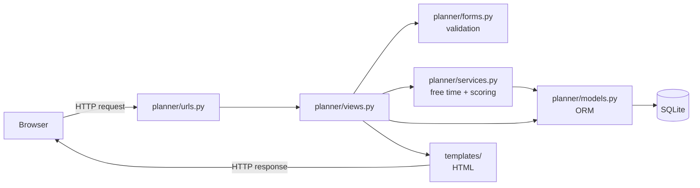
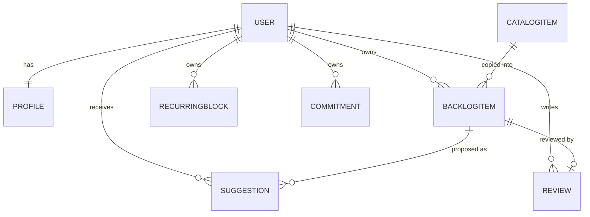
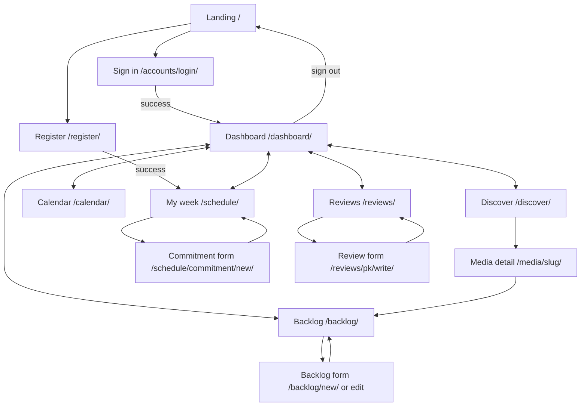
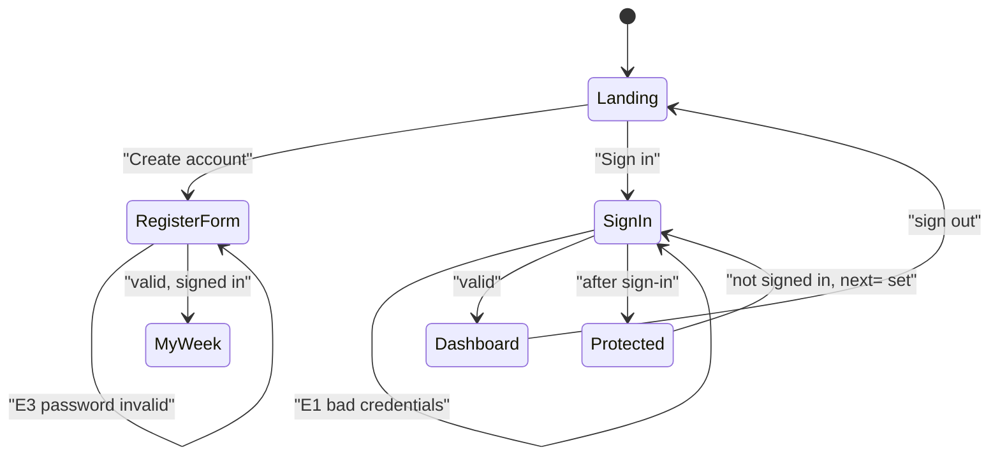
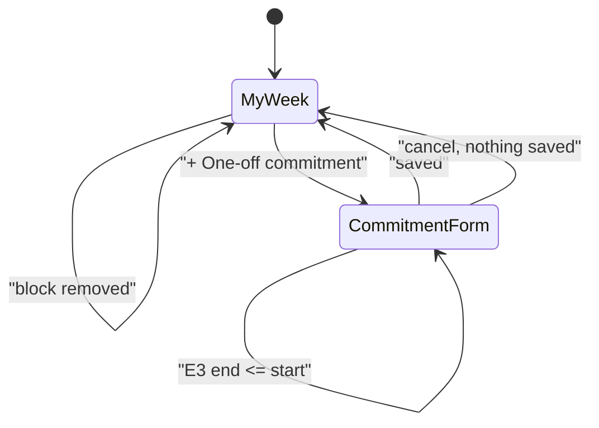
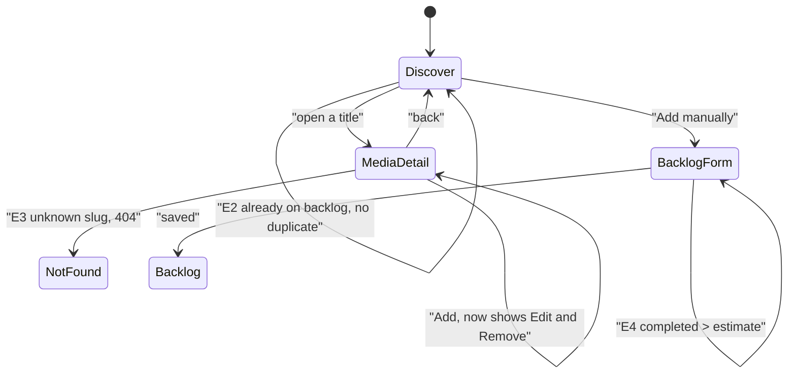
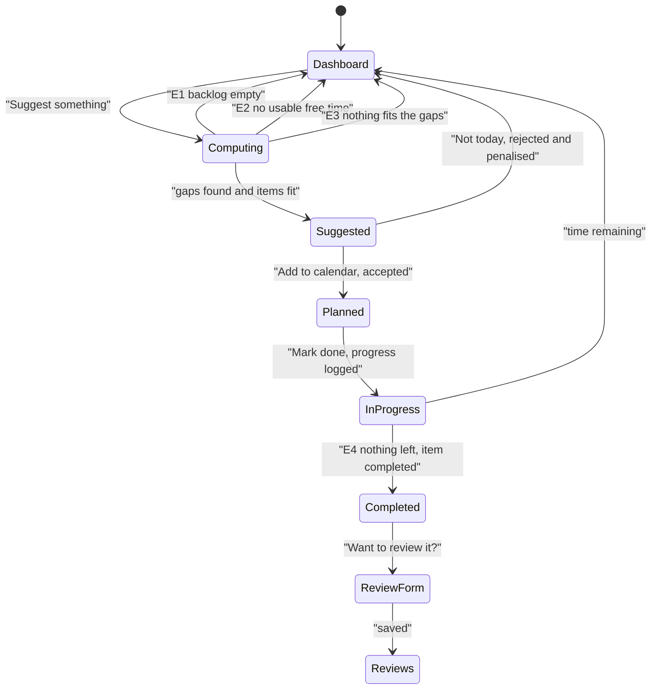
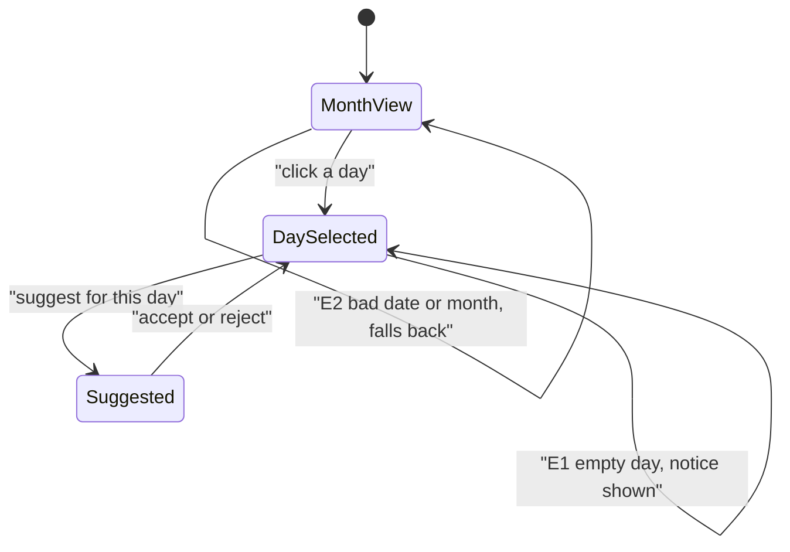

# MediaFlow: specification and design

Team 2, CSE 3311. Iteration 1.

This describes the prototype we actually built. Where the inception deck and
the code disagree we wrote down what the code does, since that's what runs.
Section 6.3 lists the things we left out.

Contents:

1. Overview
2. Inputs and outputs
3. Data structures
4. Use cases
5. Screen transitions
6. Consistency and traceability

---

## 1. Overview

MediaFlow holds a student's films, TV, books and games in one backlog, works
out when they're free, and suggests something from the backlog that fits the
time they have.

Actors:

| Actor | What they can do |
| --- | --- |
| Visitor | Not signed in. Landing page, register, sign in. |
| Student | Signed in with a `@mavs.uta.edu` address. Does almost everything below. |
| Administrator | Django admin. Maintains the shared catalog. |
| System clock | Supplies the current date and time. We count it as an actor because free time is measured against it. |

It's a server-rendered Django app. Requests come in through
`planner/urls.py` and are handled in `planner/views.py`. All the scheduling
logic sits in `planner/services.py` instead of in the views, so we can test it
without going through HTTP. There's no JavaScript framework and nothing is
kept on the client.

---

## 2. Inputs and outputs

### 2.1 What every signed-in request carries

These four are easy to forget, so we're listing them once rather than
repeating them on every screen.

| Input | Comes from | What it's for |
| --- | --- | --- |
| Session cookie | Browser | Says who's signed in. Missing or bad means a redirect to the sign-in page. |
| CSRF token | Hidden field on every POST form | Blocks cross-site posts. Missing means a 403. |
| Current date and time | Server clock | Decides what "today" means, hides gaps that have already gone by, timestamps writes. |
| `next` | Hidden field on the suggestion and priority forms | Which screen to go back to. Falls back to the dashboard. |

### 2.2 Screen by screen

**Register**, `POST /register/`

| Field | Type | Required | Rules |
| --- | --- | --- | --- |
| `username` | text | yes | Django's default rules, must be unique |
| `email` | email | yes | Has to end in `@mavs.uta.edu`, and can't already be in use |
| `password1`, `password2` | password | yes | Must match, and pass Django's validators |

**Sign in**, `POST /accounts/login/`: `username` and `password`.

**Waking hours**, `POST /schedule/` with `save_profile`

| Field | Type | Required | Rules |
| --- | --- | --- | --- |
| `day_start` | time | yes | |
| `day_end` | time | yes | Has to be after `day_start` |

**Recurring block**, `POST /schedule/` with `add_block`

| Field | Type | Required | Rules |
| --- | --- | --- | --- |
| `label` | text, up to 120 | yes | |
| `kind` | class, work, study or other | yes | Has to be one of the listed choices |
| `weekday` | 0 to 6, Monday is 0 | yes | Has to be one of the listed choices |
| `start_time` | time | yes | |
| `end_time` | time | yes | Has to be after `start_time` |

**One-off commitment**, `POST /schedule/commitment/new/`

| Field | Type | Required | Rules |
| --- | --- | --- | --- |
| `title` | text, up to 200 | yes | |
| `starts_at` | datetime-local | yes | Parsed as `%Y-%m-%dT%H:%M` |
| `ends_at` | datetime-local | yes | Has to be after `starts_at` |

**Catalog search**, `GET /discover/`. Everything is optional and anything left
blank just isn't applied.

| Field | Type | Rules |
| --- | --- | --- |
| `q` | text | Searched against title, creator and description |
| `media_type` | movie, tv, book or game | One of the listed choices |
| `genre` | built from whatever genres are in the catalog | One of the listed choices |
| `max_minutes` | integer | At least 1 |
| `sort` | title, -rating, -release_date, typical_minutes | Defaults to title |

**Backlog item entered by hand**, `POST /backlog/new/` and
`POST /backlog/<pk>/edit/`

| Field | Type | Required | Rules |
| --- | --- | --- | --- |
| `title` | text, up to 200 | yes | |
| `media_type` | one of the four types | yes | One of the listed choices |
| `priority` | integer | yes | 1 to 5 |
| `estimated_minutes` | integer | yes | 0 or more |
| `minutes_completed` | integer | yes | 0 or more, and not more than `estimated_minutes` |
| `status` | backlog, in_progress, completed, paused | yes | One of the listed choices |
| `notes` | long text | no | |

**Review**, `POST /reviews/<pk>/write/`: `rating`, an integer 1 to 5 and
required, plus an optional `body`.

Everything else:

| Input | Where | Notes |
| --- | --- | --- |
| `priority` | `POST /backlog/<pk>/priority/` | Clamped to 1 to 5. Something that isn't a number leaves it alone. |
| `date` | `POST /suggestions/refresh/` and `GET /calendar/?date=` | `YYYY-MM-DD`. Anything we can't parse falls back to today. |
| `year`, `month` | `GET /calendar/` | Which month to draw. Bad values fall back to the month of the selected day. |
| `status` | `GET /backlog/?status=` | Filters the list. Unrecognised values are ignored. |
| `action` | `POST /suggestions/<pk>/<action>/` | `accept`, `reject` or `done`. Anything else is a 404. |
| `--demo` | `python manage.py seed_catalog --demo` | Also builds the demo student account. |

### 2.3 Outputs

| Output | From | Detail |
| --- | --- | --- |
| HTML page | Every GET | The nine screens in section 5 |
| Redirect after a POST | Every successful write | So refreshing never repeats the write |
| Flash message | Writes, and suggestion runs that come back empty | Either a confirmation or an explanation |
| Field errors | Any invalid form | Form comes back with what was typed, plus the messages |
| Free intervals | `free_intervals()` | Start, end and length of each usable gap |
| Suggestions | `suggest_for_day()` | Up to 3 `Suggestion` rows, each with a reason written out |
| Database rows | All writes | See section 3 |
| 404 | Unknown slug or pk, someone else's row, unknown action | Ownership is enforced by filtering on `user` |
| 302 to sign-in | Any `@login_required` view while signed out | Carries `?next=` so you land where you meant to |
| 405 | GET on an action that only takes POST | From `@require_POST` |

The suggestion reasons are generated from the item and the gap, so the output
explains itself. There are three shapes:

- "You have 3h free and its 2h 35m runtime fits in one sitting." for a film
- "2h free is just enough to finish it." when it's the last sitting
- "2h free, so a chapter of this is a comfortable fit." for anything chunked

---

## 3. Data structures

### 3.1 What we store

`Profile` holds waking hours, which bound the window we search for free time
in. One-to-one with the user, created when they register. `day_start` and
`day_end` default to 08:00 and 23:00.

`CatalogItem` is the shared catalog everyone searches.

| Field | Type | Notes |
| --- | --- | --- |
| `title` | char(200) | |
| `slug` | slug, unique | Built from title plus type, so Dune the film and Dune the novel can both exist |
| `media_type` | choice | movie, tv, book, game |
| `genre`, `creator` | char | Optional. Genre feeds the Discover filter. |
| `description` | text | |
| `release_date` | date, nullable | |
| `rating` | decimal(3,1), nullable | Out of 10 |
| `typical_minutes` | positive int | The field the scheduler runs on |

`BacklogItem` is one entry on a student's own backlog.

| Field | Type | Notes |
| --- | --- | --- |
| `user` | FK | Owner |
| `catalog_item` | FK, nullable | Null when the item was typed in by hand |
| `title`, `media_type` | copied off the catalog row | Kept here so the entry survives the catalog row going away |
| `priority` | small int | 1 to 5, 5 goes first |
| `estimated_minutes`, `minutes_completed` | positive int | The difference is `remaining_minutes` |
| `status` | choice | backlog, in_progress, completed, paused |
| `notes` | text | |
| `added_at`, `completed_at` | datetime | |

Ordered by `-priority, added_at`. There's a unique constraint on
`(user, catalog_item)` so the same catalog title can't be added twice. It's
conditional on `catalog_item` not being null, otherwise every hand-typed item
after the first would collide.

`RecurringBlock` is something that happens every week.

| Field | Type | Notes |
| --- | --- | --- |
| `label` | char(120) | e.g. "CSE 3311 lecture" |
| `kind` | choice | class, work, study, other |
| `weekday` | small int | Monday is 0, same as Python's `weekday()` |
| `start_time`, `end_time` | time | End has to be after start |

`Commitment` is a one-off dated obligation: `title`, `starts_at`, `ends_at`.

`Suggestion` is one proposal, meaning this item, in this gap, on this day.

| Field | Type | Notes |
| --- | --- | --- |
| `user`, `backlog_item` | FK | |
| `date` | date | |
| `start_time`, `end_time`, `minutes` | time, time, int | The sitting we're proposing |
| `reason` | char(240) | The generated explanation |
| `status` | choice | pending, accepted, rejected, done |
| `created_at`, `responded_at` | datetime | |

We keep the rejected rows rather than deleting them, because the scorer reads
them back to stop pushing something the user already turned down.

`Review` is one-to-one with a backlog item: `rating` 1 to 5, and an optional
`body`.

### 3.2 Structures we build at runtime

| Structure | Where | Shape and what it's for |
| --- | --- | --- |
| `SESSION_RULES` | `models.py` | `{media_type: {chunkable, chunk_minutes, max_minutes, unit}}`. This is what makes a film behave differently from a book. |
| `Interval` | `services.py` | Frozen dataclass of `(start, end)` with `minutes` and `label`. One free gap. |
| `BusyBlock` | `services.py` | Frozen dataclass of `(start, end, label, source)`, source being recurring, commitment or planned. Flattens three different row types into one shape so the sweep can treat them the same. |
| `day_plan()` result | `services.py` | `{date, busy[], free[], planned[], pending[]}`. Everything one day's screen needs in a single call. |
| `month_grid()` result | `services.py` | A list of weeks, each 7 cells of `{date, in_month, is_today, planned[]}`. Built off one query instead of one per cell. |
| Rejection counts | `services.py` | `{backlog_item_id: count}` over the last 14 days. |

### 3.3 Why we modelled it this way

Duration is a real field on both `CatalogItem` and `BacklogItem` rather than
something we look up later. The whole point of the app is answering "what fits
the time I have", and you can't answer that unless every item carries a number
of minutes.

`SESSION_RULES` is a lookup table instead of a pile of if-statements. Adding a
fifth media type later means adding a row, not editing the scheduler.

We store when the user is busy and work out when they're free, rather than the
other way round. Students know their class times; they don't know their gaps.
It also means free time can never be stale, because it's recalculated every
time instead of being saved somewhere.

`BusyBlock` exists so that recurring blocks, dated commitments and
already-accepted sessions all come out of `busy_blocks()` in the same shape.
Without it the sweep in `free_intervals()` would need three branches.

Rejections are rows rather than a flag on the item, which lets the penalty fade
after 14 days instead of hiding a title forever.

`BacklogItem` copies the title and type off the catalog row instead of only
pointing at it. The FK is `on_delete=SET_NULL`, so if a catalog entry is
removed the user's backlog still reads properly.

### 3.4 The algorithms

**Free time**, `free_intervals(user, day)`:

1. Put a cursor at `day_start`. The limit is `day_end`.
2. If the day is today, move the cursor up to the current time, since there's
   no point offering a gap that's already gone.
3. Walk `busy_blocks()` in start order. Skip any block that ends before the
   cursor. If a block starts after the cursor, the space between is a gap.
   Either way the cursor jumps to the end of the block. Overlapping blocks sort
   themselves out here, because the cursor only ever moves forward.
4. Whatever is left at the end is the last gap. Throw away anything shorter
   than `MIN_USABLE_MINUTES`, which is 20.

**How long a sitting**, `BacklogItem.session_minutes_for(available)`:

For something not chunkable, meaning a film, return the full remaining runtime
if it fits the gap and `None` if it doesn't. `None` means it isn't a candidate
at all. For everything else, cap at `max_minutes` for one sitting, return the
remainder if that would finish the item, and otherwise round down to whole
`chunk_minutes` units. If not even one unit fits, that's `None` too.

**Scoring**, `_score(item, gap, rejections)`:

| Term | Weight |
| --- | --- |
| Priority | `priority x 20` |
| Already started | `+25` |
| How much of the gap gets used | `+ (minutes / gap) x 30` |
| It's a film and it fits | `+15` |
| The sitting would finish it | `+20` |
| Each rejection in the last 14 days | `-35` |

`suggest_for_day()` takes the biggest gaps first, picks the highest scorer for
each one, won't repeat an item within the same day, and stops after three.

---

## 4. Use cases

Every use case below except UC-1 and UC-2 needs the user signed in, so
"not signed in means a 302 to `/accounts/login/?next=<url>`" applies to all of
them and we haven't repeated it each time.

### UC-1 Register

Actor: visitor. Goal: get an account.

Main flow: open `/register/`, enter a username, UTA email and password twice,
submit. The account and profile are created, they're signed in, and they land
on My week with "Start by telling us when you are busy".

We send them to My week rather than the dashboard on purpose. A brand new
account has no commitments recorded, so the dashboard would show the whole day
as free and no suggestions, which looks broken.

Exceptions:

- E1 Email isn't `@mavs.uta.edu`. Form comes back with "MediaFlow is open to UTA students..."
- E2 Email already used. "An account already uses that email."
- E3 Passwords don't match, or fail Django's validators. Field errors.
- E4 Username taken. Field error.

### UC-2 Sign in and sign out

Main flow: `/accounts/login/`, enter credentials, land on the dashboard.

Exceptions:

- E1 Wrong credentials. Form comes back with an error.
- E2 Hitting a protected page while signed out. Redirected to sign-in with
  `?next=`, then forwarded to the page they originally wanted.

Signing out is a POST from the nav on any page, and goes to the landing page.

### UC-3 Record the weekly schedule

Goal: tell the app when the student is busy.

Main flow: on My week, fill in "Add a recurring block" and submit. The block is
saved, the page comes back with it listed under its weekday, and the free time
figures for the next seven days update.

Exceptions:

- E1 `end_time` is not after `start_time`. "End time must be after start time."
- E2 Missing a required field. Field errors.
- E3 Overlapping blocks are allowed. We don't reject them; they merge when free
  time is calculated.

### UC-4 Set waking hours

Main flow: My week, the "Waking hours" form, save. Free time is recalculated
inside the new window.

Exception: E1 bedtime isn't after the wake-up time, so "Your bedtime needs to
be after your wake-up time."

### UC-5 Add a one-off commitment

Main flow: My week, "+ One-off commitment", enter a title and a start and end,
save. Back to My week, and free time on that date drops.

Exceptions:

- E1 End isn't after start. Validation error.
- E2 Cancel. Nothing saved.
- E3 A commitment running past midnight gets clipped to each day it covers.

### UC-6 Search the catalog

Main flow: Discover, then any mix of search text, type, genre, max minutes and
sort order. Results come back with a count.

Exceptions:

- E1 Nothing matches. "Nothing matched those filters."
- E2 No filters at all. Whole catalog, capped at 60 rows.
- E3 `max_minutes` below 1. Field error.

### UC-7 View media details

Main flow: click a result to get the detail page, with the description,
creator, release date, rating, how long it usually takes, and whether it fits
today measured against the longest gap the user currently has.

Exceptions:

- E1 Unknown slug. 404.
- E2 No free time today at all. Shows "No free time" instead of yes or no.
- E3 Already on the backlog. Shows Edit and Remove instead of Add.

### UC-8 Add something to the backlog

Main flow: press Add from either Discover or the detail page. A backlog item is
created from the catalog row and carries its duration across. Confirmation
message, and the button turns into "On your backlog".

Exceptions:

- E1 Already there. "... is already on your backlog" and nothing is duplicated,
  which the unique constraint guarantees.
- E2 Not in the catalog at all. Use Add manually and type in the title, type
  and duration.

### UC-9 Maintain the backlog

Main flow: the Backlog screen. Change priority from the inline dropdown, which
saves straight away, or edit an item, filter by status, or remove something.

Exceptions:

- E1 `minutes_completed` higher than `estimated_minutes`. Validation error.
- E2 Priority outside 1 to 5. Clamped.
- E3 Priority that isn't a number. Left unchanged.
- E4 Someone else's item. 404.
- E5 Setting status to completed by hand fills in `completed_at` and marks the
  time as done.

### UC-10 Get a suggestion

Actor: student. Goal: be told what to start. Needs at least one unfinished
backlog item and one usable gap.

Main flow: dashboard, "Suggest something". Any pending suggestions for today
are cleared out first, free gaps are calculated, and the best-scoring item for
each of the biggest gaps is proposed. At most three, and never the same item
twice. Each one shows its time, its length and its reason.

Exceptions:

- E1 Backlog is empty. "Add something to your backlog first..."
- E2 No usable free time. "No usable free time left that day."
- E3 Backlog has things in it but nothing fits. "Nothing in your backlog fits
  the gaps you have left that day."
- E4 Every gap is under 20 minutes. Same as E2.
- E5 Only films left and none of them fit. Same as E3.
- E6 GET instead of POST. 405.

E1 to E3 are three different messages because the fix is different in each
case, and "no suggestions" on its own wouldn't tell the user which one they're
looking at.

### UC-11 Accept a suggestion

Main flow: "Add to calendar". The suggestion goes to accepted, an item still
sitting in backlog moves to in progress, the session shows up on the calendar,
and that time stops counting as free.

Exceptions:

- E1 Someone else's suggestion. 404.
- E2 Accepting twice does nothing, since it's already accepted.

### UC-12 Reject a suggestion

Main flow: "Not today". Status goes to rejected, the user gets "We will ease
off on that one for a while", and the item loses 35 points for the next 14
days.

Exception: E1 rejecting all of them empties the list. A refresh can legitimately
suggest the same things again, just ranked lower than before.

### UC-13 Mark a session done

Main flow: "Mark done" on a planned session adds its minutes to the item's
progress.

Exceptions:

- E1 That finishes the item. Status goes to completed, `completed_at` is set,
  and the user is asked whether they want to review it.
- E2 The progress would go past the estimate. Capped at the estimate.

### UC-14 Browse the calendar

Main flow: the Calendar screen shows a month grid starting on Sunday, with
planned sessions inside the day cells. Clicking a day shows that day's busy
blocks, planned sessions and free gaps, plus a button to suggest something for
that specific day.

Exceptions:

- E1 A `?date=` we can't parse. Falls back to today.
- E2 Bad `year` or `month`. Falls back to the month of the selected day.
- E3 Empty day. "Nothing scheduled, and no free time recorded."
- E4 More than two sessions in one cell. Shows "+N more".
- E5 Paging to another month keeps whichever day was selected.

### UC-15 Review something

Main flow: Reviews, pick something under "Finished, not reviewed yet", give it
1 to 5 and optionally write something, save. It appears in the list.

Exceptions:

- E1 Rating outside 1 to 5. Field error.
- E2 Reviewing something not yet marked complete. Writing a review implies you
  finished it, so we mark it completed.
- E3 Opening a review that already exists edits it instead of making a second
  one, since it's a one-to-one.

---

## 5. Screen transitions

### 5.1 The whole app

Every signed-in screen carries the same nav, so any of the six main screens
gets to any other in one click. Only the four forms are dead ends, and each one
goes back to whichever screen opened it.

### 5.2 Registration and signing in

### 5.3 Recording the schedule

### 5.4 Discover, details, and adding to the backlog

### 5.5 The suggestion loop

This is the main feature, so it's worth reading alongside UC-10 to UC-13.

The three edges going back to Dashboard out of Computing are the three
different empty results from UC-10.

### 5.6 Calendar

---

## 6. Consistency and traceability

### 6.1 Why the flows don't contradict each other

Four rules hold everywhere, which is what keeps the use cases and the diagrams
in agreement:

1. Every successful write redirects instead of rendering. No diagram has a POST
   that stays on the same screen after succeeding, and refreshing never repeats
   a write.
2. Failed validation always comes back to the form it was submitted from, never
   forward. That's why every exception in section 5 is drawn as a self-loop.
3. The `next` field decides where an action returns to. The accept, reject and
   done buttons appear on both the dashboard and the calendar, and each page
   passes its own `next`. This is why 5.5 and 5.6 can both show the same
   accept and reject transitions without conflicting.
4. Every row is fetched filtered by `user`, so acting on someone else's data is
   a 404 on every screen. No diagram has an edge between two users' data.

There's one deliberate asymmetry worth pointing out, since it looks like a
contradiction otherwise: UC-1 finishes on My week while UC-2 finishes on the
dashboard. The reason is in UC-1.

### 6.2 Traceability

| Use case | Screens | Route | View | Tests |
| --- | --- | --- | --- | --- |
| UC-1 Register | Register, My week | `/register/` | `register` | `RegisterTests` |
| UC-2 Sign in | Sign in, Dashboard | `/accounts/login/` | Django auth | `test_dashboard_requires_login` |
| UC-3 Weekly schedule | My week | `/schedule/` | `weekly_schedule` | `FreeTimeTests` |
| UC-4 Waking hours | My week | `/schedule/` | `weekly_schedule` | `test_waking_hours_limit_search` |
| UC-5 Commitment | Commitment form | `/schedule/commitment/new/` | `add_commitment` | `test_dated_commitment` |
| UC-6 Search | Discover | `/discover/` | `discover` | `test_discover_filters` |
| UC-7 Details | Media detail | `/media/<slug>/` | `catalog_detail` | `test_pages_load` |
| UC-8 Add to backlog | Discover, detail | `/media/<pk>/add/` | `add_from_catalog` | `test_add_from_catalog` |
| UC-9 Maintain backlog | Backlog, form | `/backlog/...` | `backlog*` | `test_pages_load` |
| UC-10 Suggest | Dashboard, Calendar | `/suggestions/refresh/` | `refresh_suggestions` | `SuggestionTests`, 9 tests |
| UC-11 Accept | Dashboard, Calendar | `/suggestions/<pk>/accept/` | `respond_to_suggestion` | `test_accept_suggestion` |
| UC-12 Reject | Dashboard, Calendar | `/suggestions/<pk>/reject/` | `respond_to_suggestion` | `test_rejection_demotes_item` |
| UC-13 Mark done | Dashboard, Calendar | `/suggestions/<pk>/done/` | `respond_to_suggestion` | `test_mark_done_logs_progress` |
| UC-14 Calendar | Calendar | `/calendar/` | `calendar` | `test_month_grid_sunday_first` |
| UC-15 Review | Reviews, form | `/reviews/...` | `reviews`, `write_review` | `test_pages_load` |
| Cross-user safety | all | all | `get_object_or_404(user=...)` | `test_cannot_touch_another_users_suggestion` |

### 6.3 What we didn't build this iteration

Push notifications need service workers and a push service, and the inception
deck had them down as a stretch item from the start.

The catalog isn't scraped. It's seeded by `seed_catalog` with 36 titles we
entered ourselves. Nothing downstream cares where the rows come from as long as
they have a duration, so swapping in a real source is a change to one command.

The UTA restriction is only a check on the shape of the email address at
signup. We don't send a confirmation email, so nothing proves the address is
real.
