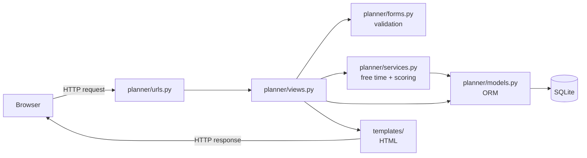
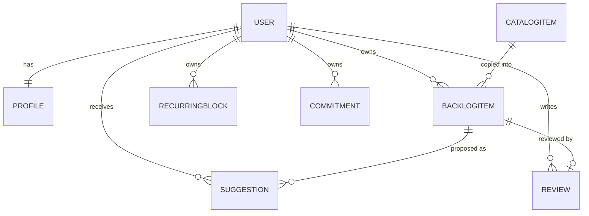
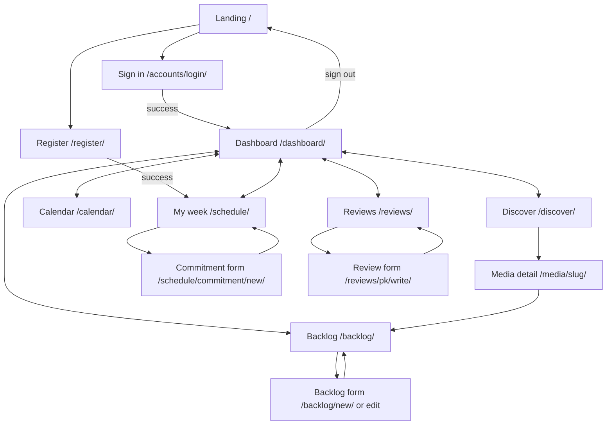
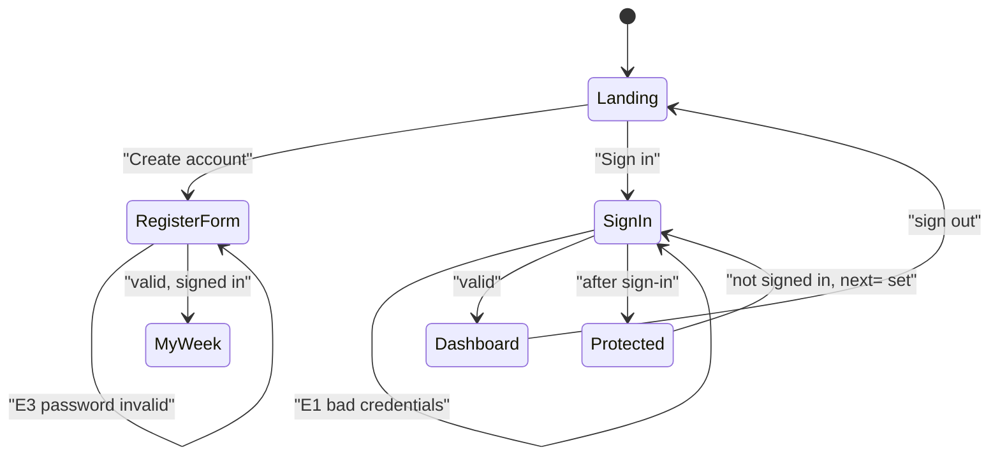
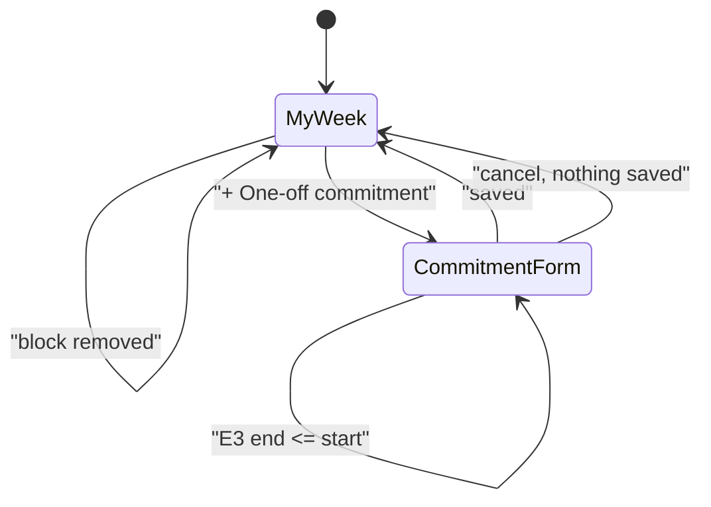
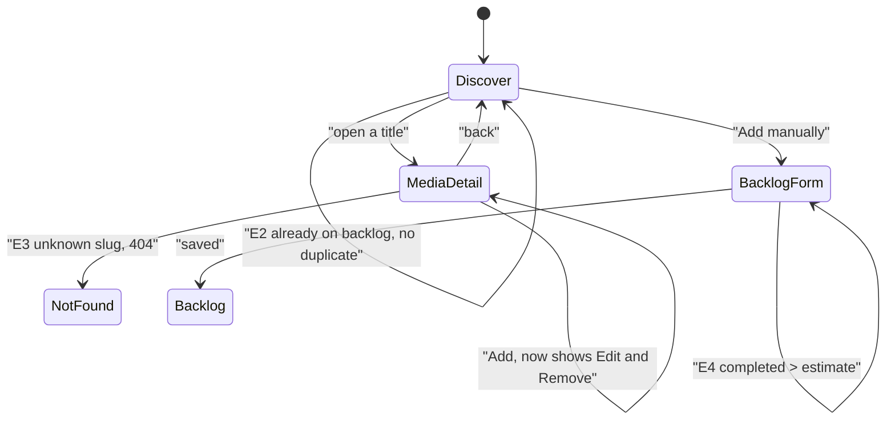
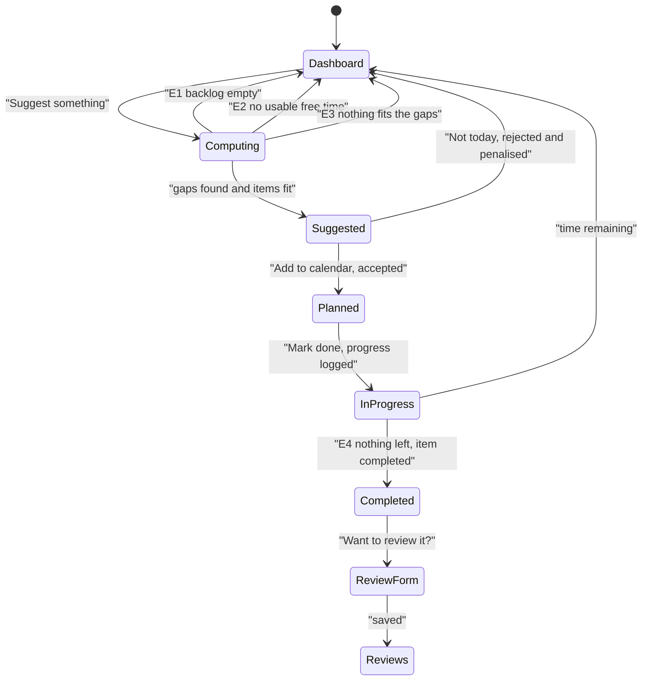
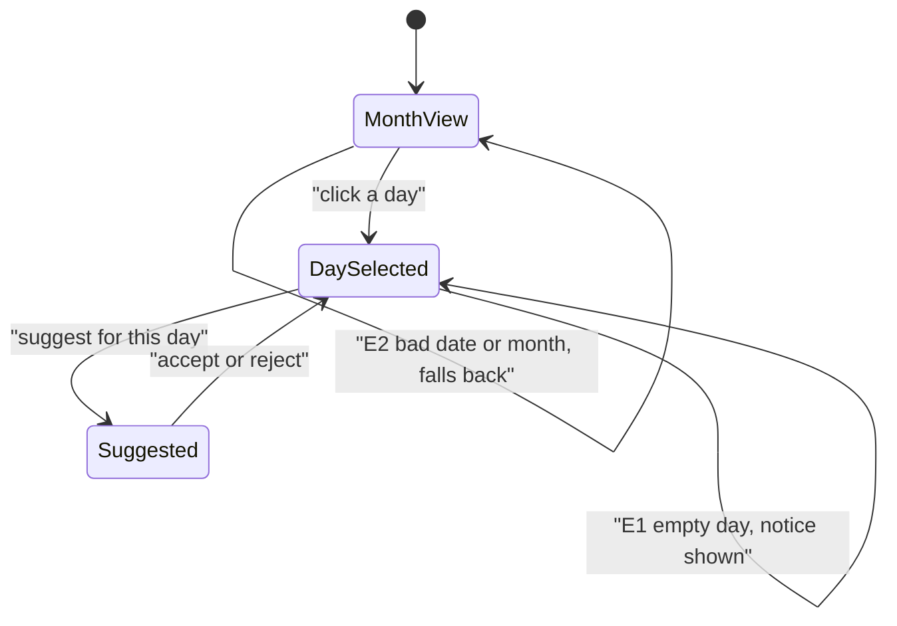

# MediaFlow — Specification and Design

CSE 3311 Team 2 · Iteration 1 prototype

This document describes the system as built. Every input, output, data
structure, use case and screen transition below is taken from the code in this
repository, not from the original proposal, so it reflects what actually runs.

- [1. System overview](#1-system-overview)
- [2. Inputs and outputs](#2-inputs-and-outputs)
- [3. Data structures](#3-data-structures)
- [4. Use cases](#4-use-cases)
- [5. Screen transition graphs](#5-screen-transition-graphs)
- [6. Consistency and traceability](#6-consistency-and-traceability)

---

## 1. System overview

MediaFlow is a Django web application that holds a student's films, TV, books
and games in one backlog, works out when they are free, and proposes something
from the backlog that fits the free time available.

**Actors**

| Actor | Description |
| --- | --- |
| Visitor | Not signed in. Can see the landing page, register, or sign in. |
| Student | A signed-in user with a `@mavs.uta.edu` address. The main actor. |
| Administrator | Django admin user. Maintains the shared catalog. |
| System clock | Supplies the current date and time. A real input: free time is computed against it. |

**Architecture.** Server-rendered Django. Requests enter through
`planner/urls.py`, are handled in `planner/views.py`, and all scheduling logic
lives in `planner/services.py` so it can be tested without HTTP. There is no
JavaScript framework and no client-side state.

---

## 2. Inputs and outputs

### 2.1 Inputs that apply to every authenticated request

| Input | Source | Purpose |
| --- | --- | --- |
| Session cookie | Browser | Identifies the signed-in user. Missing or invalid means a redirect to sign-in. |
| CSRF token | Hidden field on every POST form | Rejects cross-site posts. Missing means HTTP 403. |
| Current date/time | Server clock | Bounds "today", hides gaps that have already passed, and timestamps responses. |
| `next` (hidden field) | Suggestion and priority forms | Where to return after the action. Defaults to the dashboard. |

### 2.2 Screen-by-screen inputs

**Register** — `POST /register/`

| Field | Type | Required | Validation |
| --- | --- | --- | --- |
| `username` | text | yes | Django default; must be unique |
| `email` | email | yes | Must end in `@mavs.uta.edu`; must not already be in use |
| `password1` / `password2` | password | yes | Must match; Django's validators |

**Sign in** — `POST /accounts/login/`: `username`, `password`.

**Waking hours** — `POST /schedule/` with `save_profile`

| Field | Type | Required | Validation |
| --- | --- | --- | --- |
| `day_start` | time | yes | — |
| `day_end` | time | yes | Must be later than `day_start` |

**Recurring block** — `POST /schedule/` with `add_block`

| Field | Type | Required | Validation |
| --- | --- | --- | --- |
| `label` | text, ≤120 | yes | — |
| `kind` | choice: class / work / study / other | yes | Must be a listed choice |
| `weekday` | choice: 0–6, Monday=0 | yes | Must be a listed choice |
| `start_time` | time | yes | — |
| `end_time` | time | yes | Must be later than `start_time` |

**One-off commitment** — `POST /schedule/commitment/new/`

| Field | Type | Required | Validation |
| --- | --- | --- | --- |
| `title` | text, ≤200 | yes | — |
| `starts_at` | datetime-local | yes | Parsed as `%Y-%m-%dT%H:%M` |
| `ends_at` | datetime-local | yes | Must be later than `starts_at` |

**Catalog search** — `GET /discover/`. All optional; omitted filters are not applied.

| Field | Type | Validation |
| --- | --- | --- |
| `q` | text | Matched against title, creator and description |
| `media_type` | choice: movie / tv / book / game | Must be a listed choice |
| `genre` | choice, built from genres present in the catalog | Must be a listed choice |
| `max_minutes` | integer | Minimum 1 |
| `sort` | choice: title / -rating / -release_date / typical_minutes | Defaults to title |

**Backlog item, added or edited by hand** — `POST /backlog/new/`, `POST /backlog/<pk>/edit/`

| Field | Type | Required | Validation |
| --- | --- | --- | --- |
| `title` | text, ≤200 | yes | — |
| `media_type` | choice of the four types | yes | Must be a listed choice |
| `priority` | integer | yes | 1–5 |
| `estimated_minutes` | integer | yes | ≥ 0 |
| `minutes_completed` | integer | yes | ≥ 0 and ≤ `estimated_minutes` |
| `status` | choice: backlog / in_progress / completed / paused | yes | Must be a listed choice |
| `notes` | long text | no | — |

**Review** — `POST /reviews/<pk>/write/`: `rating` (integer 1–5, required), `body` (long text, optional).

**Other inputs**

| Input | Where | Notes |
| --- | --- | --- |
| `priority` | `POST /backlog/<pk>/priority/` | Clamped to 1–5; a non-numeric value leaves the priority unchanged |
| `date` | `POST /suggestions/refresh/`, `GET /calendar/?date=` | `YYYY-MM-DD`; anything unparseable falls back to today |
| `year`, `month` | `GET /calendar/` | Which month to draw; invalid values fall back to the selected day's month |
| `status` | `GET /backlog/?status=` | Filters the list; an unrecognised value is ignored |
| `action` | `POST /suggestions/<pk>/<action>/` | `accept`, `reject` or `done`; anything else is HTTP 404 |
| `--demo` | `python manage.py seed_catalog --demo` | Also creates the demo student account |

### 2.3 Outputs

| Output | Produced by | Detail |
| --- | --- | --- |
| Rendered HTML page | Every GET | The nine screens in §5 |
| Redirect after POST | Every successful write | Post/Redirect/Get, so a refresh never repeats a write |
| Flash message | Writes and failed suggestion runs | Success, or an explanation of why nothing was suggested |
| Field errors | Any invalid form | Re-renders the form with the submitted values and messages |
| Derived free intervals | `free_intervals()` | Start, end and length of each usable gap |
| Suggestions | `suggest_for_day()` | Up to 3 `Suggestion` rows, each with a human-readable reason |
| Persisted records | All writes | See §3 |
| HTTP 404 | Unknown slug/pk, another user's row, unknown action | Ownership is enforced by filtering on `user` |
| HTTP 302 to sign-in | Any `@login_required` view while signed out | With `?next=` so the user lands where they meant to |
| HTTP 405 | GET on a POST-only action | `@require_POST` |

**Generated text.** Suggestion reasons are built from the item and the gap, so
the output explains itself. One of:

- *"You have 3h free and its 2h 35m runtime fits in one sitting."* (film)
- *"2h free is just enough to finish it."* (last sitting)
- *"2h free, so a chapter of this is a comfortable fit."* (chunked)

---

## 3. Data structures

### 3.1 Stored entities

**Profile** — waking hours, which bound the window free time is searched in.

| Field | Type | Notes |
| --- | --- | --- |
| `user` | one-to-one | Created at registration |
| `day_start`, `day_end` | time | Default 08:00 and 23:00 |

**CatalogItem** — the shared, app-wide catalog that everyone searches.

| Field | Type | Notes |
| --- | --- | --- |
| `title` | char(200) | |
| `slug` | slug, unique | Built from title + type, so *Dune* the film and *Dune* the novel can coexist |
| `media_type` | choice | movie / tv / book / game |
| `genre`, `creator` | char | Optional; genre drives the Discover filter |
| `description` | text | |
| `release_date` | date, nullable | |
| `rating` | decimal(3,1), nullable | 0–10 |
| `typical_minutes` | positive int | **The field the scheduler depends on** |

**BacklogItem** — one entry on a student's personal backlog.

| Field | Type | Notes |
| --- | --- | --- |
| `user` | FK | Owner |
| `catalog_item` | FK, nullable | Null for hand-typed items |
| `title`, `media_type` | copied from catalog | Kept on the row so the item survives a catalog deletion |
| `priority` | small int | 1–5, 5 first |
| `estimated_minutes`, `minutes_completed` | positive int | Difference drives `remaining_minutes` |
| `status` | choice | backlog / in_progress / completed / paused |
| `notes` | text | |
| `added_at`, `completed_at` | datetime | |

Ordering is `-priority, added_at`. A unique constraint on
`(user, catalog_item)` prevents adding the same catalog title twice; it is
conditional on `catalog_item` being non-null so hand-typed items are exempt.

**RecurringBlock** — something that happens every week.

| Field | Type | Notes |
| --- | --- | --- |
| `label` | char(120) | "CSE 3311 lecture" |
| `kind` | choice | class / work / study / other |
| `weekday` | small int | Monday=0, matching Python's `weekday()` |
| `start_time`, `end_time` | time | End must be after start |

**Commitment** — a one-off dated obligation. `title`, `starts_at`, `ends_at`.

**Suggestion** — one proposal: this item, in this gap, on this day.

| Field | Type | Notes |
| --- | --- | --- |
| `user`, `backlog_item` | FK | |
| `date` | date | |
| `start_time`, `end_time`, `minutes` | time / int | The proposed sitting |
| `reason` | char(240) | The generated explanation |
| `status` | choice | pending / accepted / rejected / done |
| `created_at`, `responded_at` | datetime | |

Rejected rows are **kept on purpose**: the scorer reads them back so a
declined title stops being pushed.

**Review** — one-to-one with a backlog item. `rating` 1–5, optional `body`.

### 3.2 In-memory structures

| Structure | Where | Shape and purpose |
| --- | --- | --- |
| `SESSION_RULES` | `models.py` | `{media_type: {chunkable, chunk_minutes, max_minutes, unit}}`. The table that makes a film behave differently from a book. |
| `Interval` | `services.py` | Frozen dataclass `(start, end)` with `minutes` and `label`. One free gap. |
| `BusyBlock` | `services.py` | Frozen dataclass `(start, end, label, source)` where source is recurring / commitment / planned. Normalises three different row types into one shape so the sweep can treat them alike. |
| `day_plan()` result | `services.py` | `{date, busy[], free[], planned[], pending[]}`. Everything one day's screen needs, in one call. |
| `month_grid()` result | `services.py` | List of weeks, each 7 cells of `{date, in_month, is_today, planned[]}`. Built from a single query rather than one per cell. |
| Rejection counts | `services.py` | `{backlog_item_id: count}` over the last 14 days. |

### 3.3 Why these structures suit the features

- **Duration is a first-class field** on both `CatalogItem` and `BacklogItem`.
  The whole product claim is "what fits the time you have", which is only
  answerable if every item carries a number of minutes.
- **`SESSION_RULES` is a table, not conditionals.** Adding a media type means
  adding one row, not editing the scheduler.
- **Busy is stored; free is derived.** Students know their classes, not their
  gaps. Free time is computed on demand, so it is never stale after an edit.
- **`BusyBlock` unifies three sources**, which is what lets one sweep handle
  recurring blocks, dated commitments and already-accepted plans together.
- **Rejections are rows, not a flag**, so the penalty can decay over 14 days
  instead of blocking a title forever.
- **Title and type are copied onto `BacklogItem`** rather than only referenced,
  so a user's backlog is readable even if the catalog row is removed
  (`on_delete=SET_NULL`).

### 3.4 Algorithms over those structures

**Free-time detection** — `free_intervals(user, day)`

1. Start a cursor at `day_start`; the limit is `day_end`.
2. If the day is today, move the cursor forward to now, since a gap that has
   passed cannot be offered.
3. Walk `busy_blocks()` in start order. A block ending before the cursor is
   skipped; a block starting after it yields a gap; the cursor then jumps to
   the block's end. Overlapping blocks merge automatically because the cursor
   only ever moves forward.
4. Emit the tail gap. Discard anything shorter than `MIN_USABLE_MINUTES` (20).

**Sitting length** — `BacklogItem.session_minutes_for(available)`

- Not chunkable (film): return the full remaining runtime if it fits the gap,
  otherwise **`None`** — the item is not a candidate at all.
- Chunkable: cap at `max_minutes` (one realistic sitting), return the remainder
  if it would finish the item, else round down to whole `chunk_minutes` units.
  Returns `None` if not even one unit fits.

**Scoring** — `_score(item, gap, rejections)`

| Term | Weight |
| --- | --- |
| Priority | `priority × 20` |
| Already in progress | `+25` |
| Share of the gap used | `+ (minutes / gap) × 30` |
| Item is a film that fits | `+15` |
| Sitting would finish the item | `+20` |
| Each rejection in the last 14 days | `−35` |

`suggest_for_day()` takes the largest gaps first, picks the highest scorer for
each, never repeats an item within a day, and stops at three.

---

## 4. Use cases

Each use case lists its exception flows. "Signed in" as a precondition implies
the exception *"not signed in → HTTP 302 to `/accounts/login/?next=<url>`"*,
which applies to every use case below except UC-1 and UC-2 and is not repeated.

### UC-1 Register

- **Actor** Visitor · **Goal** Get an account
- **Main flow** Open `/register/` → enter username, UTA email, password twice →
  submit → account and profile created, signed in → redirected to **My week**
  with "Start by telling us when you are busy".
- **Why My week, not the dashboard:** with no commitments recorded there is no
  free time to plan around, so the dashboard would look broken.
- **Exceptions**
  - E1 Email not `@mavs.uta.edu` → form redisplays: "MediaFlow is open to UTA students…"
  - E2 Email already used → "An account already uses that email."
  - E3 Passwords differ or fail Django's validators → field errors
  - E4 Username taken → field error

### UC-2 Sign in / sign out

- **Main flow** `/accounts/login/` → credentials → dashboard.
- **Exceptions** E1 Wrong credentials → form redisplays with an error.
  E2 Visiting a protected page while signed out → redirect to sign-in carrying
  `?next=`, then on to the original page after signing in.
- **Sign out** POST from the nav on any page → landing page.

### UC-3 Record the weekly schedule

- **Goal** Tell the system when the student is busy
- **Main flow** **My week** → fill "Add a recurring block" → submit → block
  saved → page reloads showing it grouped by weekday, and the seven-day free
  time figures update.
- **Exceptions** E1 `end_time` ≤ `start_time` → "End time must be after start time."
  E2 Missing required field → field errors. E3 Overlapping blocks are accepted
  deliberately and merge when free time is computed.

### UC-4 Set waking hours

- **Main flow** **My week** → "Waking hours" → save → free time is recomputed
  within the new window.
- **Exceptions** E1 Bedtime ≤ wake-up → "Your bedtime needs to be after your wake-up time."

### UC-5 Add a one-off commitment

- **Main flow** **My week** → "+ One-off commitment" → title and start/end →
  save → returns to My week; that date's free time drops.
- **Exceptions** E1 End ≤ start → validation error. E2 Cancel → returns with
  nothing saved. E3 A commitment crossing midnight is clipped to each day it
  touches.

### UC-6 Search the catalog

- **Main flow** **Discover** → any combination of text, type, genre, max
  minutes, sort → results list with a count.
- **Exceptions** E1 No matches → "Nothing matched those filters."
  E2 No filters → whole catalog, capped at 60 rows.
  E3 `max_minutes` below 1 → field error.

### UC-7 View media details

- **Main flow** Click a result → detail page with description, creator, release
  date, rating, typical duration, and whether it **fits today** against the
  longest current gap.
- **Exceptions** E1 Unknown slug → HTTP 404. E2 No free time today → "No free
  time" instead of yes/no. E3 Already on the backlog → shows Edit/Remove rather
  than Add.

### UC-8 Add something to the backlog

- **Main flow** Press **Add** on Discover or the detail page → a backlog item is
  created from the catalog row, carrying its duration → confirmation, and the
  button becomes "On your backlog".
- **Exceptions** E1 Already present → "… is already on your backlog", nothing
  duplicated (unique constraint). E2 Item not in the catalog → **Add manually**
  and enter title, type, duration by hand.

### UC-9 Maintain the backlog

- **Main flow** **Backlog** → change priority from the inline dropdown (saves
  immediately), edit an item, filter by status, or remove an item.
- **Exceptions** E1 `minutes_completed` > `estimated_minutes` → validation error.
  E2 Priority outside 1–5 → clamped. E3 Non-numeric priority → unchanged.
  E4 Another user's item → HTTP 404. E5 Setting status to *completed* by hand
  backfills `completed_at` and marks the time complete.

### UC-10 Get a suggestion

- **Actor** Student · **Goal** Be told what to start
- **Preconditions** At least one unfinished backlog item and one usable gap
- **Main flow** **Dashboard** → "Suggest something" → pending suggestions for
  today are cleared → free gaps are computed → the best-scoring item for each of
  the largest gaps is proposed, at most three, no item twice → each is shown
  with its time, length and reason.
- **Exceptions**
  - E1 Backlog empty → "Add something to your backlog first…"
  - E2 No usable free time → "No usable free time left that day."
  - E3 Backlog non-empty but nothing fits → "Nothing in your backlog fits the gaps you have left that day."
  - E4 Every gap under 20 minutes → treated as E2
  - E5 Only films left and none fit the gap → E3
  - E6 GET instead of POST → HTTP 405

### UC-11 Accept a suggestion

- **Main flow** "Add to calendar" → status becomes *accepted*; a *backlog* item
  becomes *in progress*; the session appears on the calendar and that time is no
  longer free.
- **Exceptions** E1 Another user's suggestion → HTTP 404. E2 Accepting twice is
  harmless; the row is already accepted.

### UC-12 Reject a suggestion

- **Main flow** "Not today" → status *rejected* → "We will ease off on that one
  for a while" → the item loses 35 points for 14 days.
- **Exceptions** E1 All suggestions rejected → the list empties; a refresh may
  legitimately propose the same items again, now ranked lower.

### UC-13 Mark a session done

- **Main flow** "Mark done" on a planned session → its minutes are added to the
  item's progress.
- **Exceptions** E1 Item now fully complete → status *completed*, `completed_at`
  set, and the user is invited to review it. E2 Progress would exceed the
  estimate → capped at the estimate.

### UC-14 Browse the calendar

- **Main flow** **Calendar** → month grid, Sunday first, with planned sessions
  in each day cell → click a day → that day's busy blocks, planned sessions and
  free gaps, plus a button to suggest something for that day.
- **Exceptions** E1 Unparseable `?date=` → falls back to today. E2 Invalid
  `year`/`month` → falls back to the selected day's month. E3 Empty day → "Nothing
  scheduled, and no free time recorded." E4 More than two sessions in a cell →
  "+N more". E5 Paging months keeps the selected day.

### UC-15 Review something finished

- **Main flow** **Reviews** → an item under "Finished, not reviewed yet" →
  rating 1–5 and optional text → saved and listed.
- **Exceptions** E1 Rating outside 1–5 → field error. E2 Reviewing an item not
  yet marked complete → completing it is implied, so the item is marked
  completed. E3 Re-opening an existing review edits it rather than creating a
  second one (one-to-one).

---

## 5. Screen transition graphs

### 5.1 Whole-application screen map

Every authenticated screen carries the same nav, so any of the six main screens
reaches any other in one click. Only the four forms are leaf screens, and each
returns to the screen that opened it.

### 5.2 Registration and sign-in, including exceptions

### 5.3 Recording the schedule

### 5.4 Discover, media detail and adding to the backlog

### 5.5 The suggestion loop — the core feature

The three exception edges out of `Computing` are the three distinct empty
results, each with its own message, because the fix differs in each case.

### 5.6 Calendar

---

## 6. Consistency and traceability

### 6.1 Why the use cases and graphs do not conflict

Four conventions hold across every screen, so no two flows can contradict:

1. **Post/Redirect/Get everywhere.** Every successful write redirects; no
   transition graph has a POST that stays put on success. A refresh never
   repeats a write.
2. **Failed validation always returns to the same form**, never forward. Every
   exception edge in §5 is a self-loop on the form it came from.
3. **`next` decides the return screen.** The suggestion actions appear on both
   the dashboard and the calendar, and each passes its own `next`, so UC-10 to
   UC-13 return to whichever screen invoked them. This is why §5.5 and §5.6 can
   both contain the same accept/reject transitions without conflicting.
4. **Ownership is uniform.** Every row is fetched filtered by `user`, so one
   user acting on another's row is HTTP 404 everywhere. No graph shows a
   cross-user edge.

One deliberate asymmetry: UC-1 ends on **My week** while UC-2 ends on the
**dashboard**. New accounts have no schedule, so the dashboard would show a
full day of free time and no suggestions.

### 6.2 Traceability

| Use case | Screens | Route | View | Covered by |
| --- | --- | --- | --- | --- |
| UC-1 Register | Register → My week | `/register/` | `register` | `RegisterTests` |
| UC-2 Sign in | Sign in → Dashboard | `/accounts/login/` | Django auth | `test_dashboard_requires_login` |
| UC-3 Weekly schedule | My week | `/schedule/` | `weekly_schedule` | `FreeTimeTests` |
| UC-4 Waking hours | My week | `/schedule/` | `weekly_schedule` | `test_waking_hours_limit_search` |
| UC-5 Commitment | Commitment form | `/schedule/commitment/new/` | `add_commitment` | `test_dated_commitment` |
| UC-6 Search | Discover | `/discover/` | `discover` | `test_discover_filters` |
| UC-7 Details | Media detail | `/media/<slug>/` | `catalog_detail` | `test_pages_load` |
| UC-8 Add to backlog | Discover, detail | `/media/<pk>/add/` | `add_from_catalog` | `test_add_from_catalog` |
| UC-9 Maintain backlog | Backlog, form | `/backlog/…` | `backlog*` | `test_pages_load` |
| UC-10 Suggest | Dashboard, Calendar | `/suggestions/refresh/` | `refresh_suggestions` | `SuggestionTests` (9 tests) |
| UC-11 Accept | Dashboard, Calendar | `/suggestions/<pk>/accept/` | `respond_to_suggestion` | `test_accept_suggestion` |
| UC-12 Reject | Dashboard, Calendar | `/suggestions/<pk>/reject/` | `respond_to_suggestion` | `test_rejection_demotes_item` |
| UC-13 Mark done | Dashboard, Calendar | `/suggestions/<pk>/done/` | `respond_to_suggestion` | `test_mark_done_logs_progress` |
| UC-14 Calendar | Calendar | `/calendar/` | `calendar` | `test_month_grid_sunday_first` |
| UC-15 Review | Reviews, form | `/reviews/…` | `reviews`, `write_review` | `test_pages_load` |
| Cross-user safety | all | all | `get_object_or_404(user=…)` | `test_cannot_touch_another_users_suggestion` |

### 6.3 Not in this iteration

- **Push notifications.** Needs service workers and a push service; the deck
  listed it as a stretch item.
- **A scraped catalog.** The catalog is seeded by `seed_catalog`. Everything
  downstream only needs a duration, so a real source replaces one command.
- **Email verification.** The UTA restriction is a check on the address at
  signup; the address is not confirmed.
